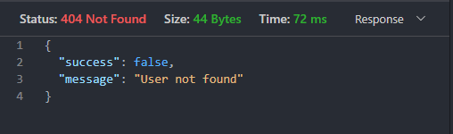

# Desafio Backend

Una breve descripción de lo que hace tu proyecto y su propósito.

## Tabla de Contenidos

- [Instalación](#instalación)
- [Uso](#uso)
- [Configuración](#configuración)
- [Contribuir](#contribuir)
- [Licencia](#licencia)
- [Contacto](#contacto)
- [Créditos](#créditos)

## Instalación

1. Clona el repositorio:

    ```bash
    git clone https://github.com/JosephColin57/Desafio_Backend
    ```

2. Navega al directorio del proyecto:

    ```bash
    cd CarpertaAsignada/Desafio_Backend
    ```

3. Instala las dependencias:

    ```bash
    npm install bcryptjs cors dotenv express http-errors jsonwebtoken mongoose nodemon
    ```

4. Instalar extension Thunderclient

    

## Uso

Para iniciar la aplicación, usa el siguiente comando:

```bash
npm run dev
```

Una vez que aparezca que la base de datos esta conectada y que el servidor esta escuchando podemos iniciar a utilizar el app

``` bash
Database connected
Server listening on http://localhost:3030
```

Abrir extension Thunderclient en VSCode

### Creacion y busqueda de usuarios

1. Para ingresar un **nuevo usuario** se debera elegir el metodo **POST** colocar en la barra de navegacion de Thunderclient http://localhost:3030/users: 


- Abrir la pestaña de **BODY** seleccionar **JSON** y colocar dentro la informacion del nuevo usuario en formato para archivo **JSON**

```java
{
  "name": "TuNombre",
  "profilePic": "tuImagenDePerfil",
  "email": "tuCorreo@Dominio.com",
  "password": "tupasswordseguro"
}
```


- Damos click en Send y nos enviara una respuesta


- En dado caso de que nos falte un dato nos dara un error


- O si ingresamos un email ya existente


2. Para buscar un usuario por id utilizamos el metodo **GET** y en la barra de Thunderclient colocamos el ID del usuario que deseamos buscar, damos click en Send


- Nos arrojara la informacion del id ingresado


### Inicio de sesion

1. Para iniciar sesion sera necesario colocar el metodo **POST** y en la barra de Thunderclient colocar http://localhost:3030/auth/login 


- Abrir la pestaña de **BODY** seleccionar **JSON** y colocar dentro la informacion de login correo y password en formato para archivo **JSON**


- Si el email ingresado es correcto junto con el password nos dara una respuesta con el token


- En caso de que la autenticacion falle por que aalguna informacion nos dara los siguientes errores:

- Correo incorrecto



- Password incorrecto


2. Una vez la autenticacion haya sido correcta tomamos el token dado en la respuesta y lo colocamos en Thunderclient en la pestaña de Headers colocamos Authorization y pegamos el token


### Posts

1. Para ver todos los posts generados seleccionamos el metodo GET en la liga http://localhost:3030/posts


Damos click en Send y nos manda la informacion de todos los posts creados por todos los usuarios 


 2. Para hacer uso del parametro **SEARCH** colocamos http://localhost:3030/posts/?search= y el titulo a buscar y damos click en send


- Nos arroja la informacion de la busqueda


 3. Para crear un post es necesario iniciar sesion con tu usuario y contraseña e ingresar a la liga: http://localhost:3030/posts

 

- Abrir la pestaña de **BODY** seleccionar **JSON** y colocar dentro la informacion del **post** en formato para archivo **JSON**

```java
{
 "title": "1er post",
 "./Images/image": "https://imgs.search.brave.com/D_8qGP3gOT6LScfmZm6nookbsQDZ1j-Id5ZejglCB0U/rs:fit:500:0:0/g:ce/aHR0cHM6Ly9zdGF0/aWMud2l4c3RhdGlj/LmNvbS9tZWRpYS80/NGRjNjNfNWZhYzgw/NzI5YWI1NGQyYzg0/MzEzZWY2NjhmNTMy/ZWJ-bXYyLmpwZy92/MS9jcm9wL3hfNzUs/eV8wLHdfNTcxLGhf/NDQwL2ZpbGwvd18z/NDYsaF8yNjYsYWxf/YyxxXzgwLHVzbV8w/LjY2XzEuMDBfMC4w/MSxlbmNfYXV0by9w/cm9ncmFtYWNpb24u/anBn",
  "body": "lorem"
}
```


-Despues de que damos Send se asigna en automatico al usuario que inicio sesion


 4. Para modificar un post solo el dueño del post lo podra hacer

 - Para ello seleccionamos el metodo PATCH y colocamos en la barra el id del post http://localhost:3030/posts/6666688896c6521670741418

 

 - Y en la respuesta nos aparece la informacion actualizada

 

 5. Para eliminar un post solo el dueño del post lo podra hacer

  - Para ello seleccionamos el metodo DELETE y colocamos en la barra el id del post http://localhost:3030/posts/6666688896c6521670741418

  

   - Damos click en Send y en la respuesta nos aparece que fue eliminado

   


## Configuracion

Asegúrate de configurar las variables de entorno que se incluyen en el archivo example.env en un archivo .env en la raíz del proyecto.

**No Comitear el .env y node modules**: 

Nunca añadas tus archivos **.env** y **node_modules** al control de versiones (git), en su lugar, añade un archivo .gitignore que ignore el .env y node_modules/

## Contribuir

¡TODAS las contribuciones son bienvenidas! 

Para contribuir, por favor sigue estos pasos:

Haz un fork del proyecto.

Crea una nueva rama 
```bash
(git checkout -b feature/nueva-funcionalidad).
```
Realiza tus cambios y haz commit 
```bash
(git commit -am 'Añade nueva funcionalidad').
```
Haz push a la rama 
```bash
(git push origin feature/nueva-funcionalidad).
```
Abre un Pull Request.

## Licencia

Este proyecto está licenciado bajo la Licencia MIT. Para más detalles, consulta el archivo [LICENSE](#LICENSE).

## Contacto

Joel Ben Joseph Colin Cano - joelbenjosephc@gmail.com

Link de GitHub: https://github.com/JosephColin57

## Créditos

Este proyecto utiliza las siguientes bibliotecas y recursos de código abierto:

- [bcryptjs](#bcryptjs): Para el hashing de contraseñas.

- [cors](#cors): Para permitir solicitudes entre dominios en Node.js.

- [dotenv](#dotenv): Para gestionar variables de entorno.

- [express](#express): Framework web para Node.js.

- [http-errors](#http-errors): Para crear errores HTTP.

- [jsonwebtoken](#jsonwebtoken): Para trabajar con JSON Web Tokens (JWT).

- [mongoose](#mongoose): Para modelar datos de MongoDB.

- [nodemon](#nodemon): Para reiniciar automáticamente el servidor en desarrollo.

Agradecimientos especiales a los desarrolladores de estas bibliotecas por su valioso trabajo y contribuciones a la comunidad de código abierto.

